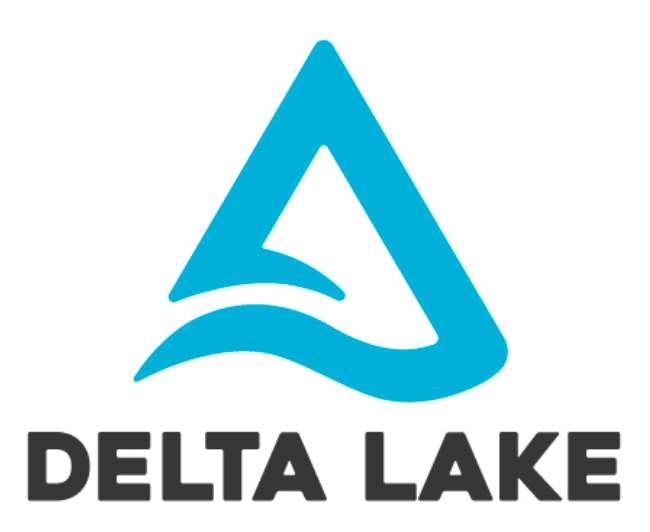

# Delta Tables for Data Management

## What Are Delta Tables?

Delta Tables, often associated with Delta Lake, are a powerful way to manage and manipulate data in your big data ecosystem. They bring ACID (Atomicity, Consistency, Isolation, Durability) transactions to your data lakes and warehouses, offering an enhanced data management experience.

## Advantages Over Plain Parquet Files

Delta Tables offer several advantages when compared to plain Parquet files:

1. **ACID Transactions**: Delta Tables support ACID transactions, ensuring data consistency and reliability, even in highly concurrent and complex data workflows. This means you can perform updates, deletes, and inserts with confidence.

2. **Data Versioning**: Keep track of historical changes to your data. Delta Tables allow you to access previous data versions, aiding in auditing, debugging, and ensuring data lineage.

3. **Schema Evolution**: With Delta Tables, your data schema can evolve gracefully over time. You can add, modify, or delete columns without breaking your existing data pipelines.

4. **Optimized Performance**: Delta Tables incorporate optimizations like data skipping and indexing, leading to improved query performance compared to plain Parquet files.

5. **Data Deduplication**: Delta Lake automatically eliminates duplicate data, reducing storage costs and speeding up query execution.

6. **Unified Data Lake**: Delta Tables serve as a unified data storage layer that can accommodate both batch and streaming data processing, eliminating the need for format conversions and simplifying data management.

7. **Compatibility**: Delta Lake integrates seamlessly with various data processing engines, such as Apache Spark, Databricks, and Presto, ensuring you can leverage its benefits within your existing data ecosystem.

8. **Data Consistency and Reliability**: ACID transactions in Delta Tables provide a robust foundation for data integrity, reducing the risk of data corruption or inconsistencies.

9. **Time Travel**: Query data at specific points in time for historical analysis and debugging purposes, allowing you to explore data changes over its lifecycle.
